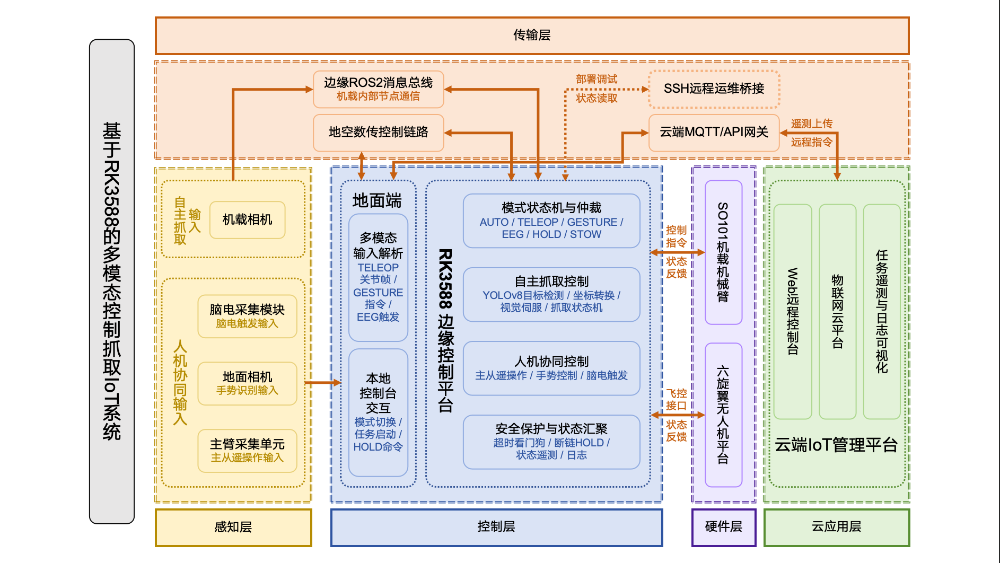

# FlyHand

FlyHand 是一个空中多模态抓取平台。在六旋翼无人机上搭载 6 自由度 SO-101 机械臂，系统将目标检测、坐标变换、飞行-机械臂协同任务状态机和地面端多模态控制整合为一套 ROS 2 与 Web 控制系统。

当前版本支持：

- **自主抓取**：YOLO 目标检测、相机到机械臂坐标变换、视觉伺服与抓取状态机；
- **主从遥操作**：SO-101 Leader 主臂经数传控制机载 Follower；
- **手势控制**：MediaPipe 手部/人体关键点识别，将手势映射为末端运动与夹爪指令；
- **脑电触发**：兼容 ADS1299/OpenBCI 类串口数据源，按阈值发送预设机械臂动作；
- **地面控制中心**：FastAPI 后端与 React/Vite 前端，提供连接、模式切换、实时遥测和手势预览。

> 项目面向研究和原型验证。无人机与机械臂会造成实际人身和财产风险，请仅在合规、封闭且受控的场地使用。



## 功能架构

```text
地面端
  SO-101 Leader / 摄像头 / EEG / Web 控制中心
                 │ 串口数传（CRC32 帧）
                 ▼
机载端 ROS 2
  serial_command_bridge ──► so101_arm_interface ──► SO-101 Follower
                 │
                 ├──► harvest_state_machine ──► 飞控任务接口
                 │
相机 ──► yolo_detector ──► coordinate_transform ──► /target/best
```

## 代码结构

```text
airborne/
├── airborne/                         # 机载 ROS 2 节点
│   ├── nodes/
│   │   ├── yolo_detector.py           # RKNN/YOLO 目标检测
│   │   └── debug_perception_viewer.py # 感知调试视图
│   ├── coordinate_transform.py        # 相机、机体和机械臂坐标变换
│   ├── harvest_state_machine.py       # 搜索、接近、伺服、抓取状态机
│   ├── serial_command_bridge.py       # 数传协议与 ROS 2 桥接
│   ├── so101_arm_interface.py         # SO-101 Follower 与逆运动学接口
│   ├── sts3215_driver.py              # STS3215 舵机驱动
│   ├── unified_radio_bridge.py        # 统一无线控制桥
│   ├── config/drone_follower.json     # 舵机 ID、零位和限位配置
│   └── launch/harvest_system.launch.py
└── ground/                            # 地面控制端
    ├── ground_so101_sender.py         # 主从、手势与脑电统一发送端
    ├── ground_so101_ui.py             # Tkinter 本地控制界面
    ├── eeg_peak_arm_sender.py         # EEG 阈值触发器
    ├── gesture_preview_only.py        # 不下发指令的手势预览
    ├── web_server.py                  # FastAPI 控制后端
    ├── requirements.txt
    └── so101-control-ui/              # React/Vite Web 控制中心
```

## 硬件与软件前提

### 硬件

- 六旋翼飞行平台、飞控与数传链路；
- 6 自由度 SO-101 Follower 机械臂，使用 STS3215 系列舵机；
- 可选 SO-101 Leader 主臂，用于主从遥操作；
- 机载相机和运行 ROS 2 的机载计算机；
- 可选 USB 摄像头和 ADS1299/OpenBCI 兼容 EEG 串口设备。

### 软件

- 地面端：Python 3.10+、Node.js 20.19+（或 22.12+）、npm；
- 地面 Python 依赖：`pyserial`、NumPy、OpenCV、MediaPipe、FastAPI、Uvicorn，见 [`ground/requirements.txt`](ground/requirements.txt)；
- 主从遥操作还需要 [LeRobot](https://github.com/huggingface/lerobot) 的 SO-101 Leader 支持；
- 机载端：ROS 2、`v4l2_camera`、`cv_bridge`、RKNN Lite 与项目所需的飞控通信节点；
- 自动模式还需要 `placo`、SciPy、目标检测模型、SO-101 URDF 以及手眼标定文件。

## 安装

### 地面控制端

```bash
cd ground
python -m venv .venv
# Linux/macOS
source .venv/bin/activate
# Windows PowerShell: .\.venv\Scripts\Activate.ps1
python -m pip install --upgrade pip
python -m pip install -r requirements.txt
```

构建 Web 控制中心：

```bash
cd so101-control-ui
npm ci
npm run build
```

`web_server.py` 会优先托管 `so101-control-ui/dist/`。构建目录不会提交到仓库，首次部署需要执行一次 `npm run build`。

### 机载 ROS 2 端

将 `airborne/` 中的节点安装到实际 ROS 2 包（当前启动文件包名为 `pine_harvester`）后，在目标设备上构建：

```bash
source /opt/ros/<distro>/setup.bash
cd <your_ros2_workspace>
colcon build --symlink-install
source install/setup.bash
```

启动文件中的设备路径、相机标定、URDF 路径和串口均为实验机参数，首次运行前必须改为本机实际值。参见 [`airborne/launch/harvest_system.launch.py`](airborne/launch/harvest_system.launch.py)。

## 快速验证

### 协议自检

```bash
cd ground
python ground_so101_sender.py --self-test
```

### 手势预览

该模式只显示手部/人体关键点，不连接主臂、数传或机械臂：

```bash
python gesture_preview_only.py
```

### Web 控制中心

```bash
cd so101-control-ui
npm ci
npm run build
cd ..
python web_server.py --no-browser
```

打开 `http://127.0.0.1:8765`。默认仅监听本机回环地址；如需局域网访问，请显式传入 `--host` 并评估现场控制权限与网络安全。

### 主从或手势控制

确认机械臂已抬离障碍物、急停可用且关节限位已校准后再打开数传：

```bash
# 手势控制：不连接 Leader 主臂
python ground_so101_sender.py --gesture-only --radio-port <COM_PORT>

# 主从遥操作
python ground_so101_sender.py --leader-port <LEADER_PORT> --radio-port <RADIO_PORT>
```

串口波特率默认 `57600`，可用 `--baudrate` 覆盖。

### 自主抓取链路

在机载端完成相机、目标模型、URDF、手眼标定和飞控接口配置后：

```bash
ros2 launch pine_harvester harvest_system.launch.py
```

建议先用 `perception_only:=true` 验证相机、YOLO 与坐标变换，再在拆桨或系留条件下启用机械臂和任务状态机。

## 控制模式

| 模式 | 用途 | 说明 |
| --- | --- | --- |
| `AUTO` | 自主抓取 | 目标检测、坐标变换与抓取状态机协同运行 |
| `TELEOP` | 主从遥操作 | Leader 主臂角度映射到 Follower |
| `GESTURE` | 手势控制 | MediaPipe 关键点生成末端/夹爪控制量 |
| `EEG` | 脑电触发 | 阈值检测发送预设动作与夹爪指令 |
| `HOLD` | 保持 | 停止动态运动并保持当前状态 |
| `STOW` | 收臂 | 回到预设安全姿态 |

## 配置与部署注意事项

- [`airborne/config/drone_follower.json`](airborne/config/drone_follower.json) 包含舵机 ID、零位偏移和关节范围。更换机械臂或重新标定后必须更新；
- ROS 2 启动文件含 `/dev/video20`、`/dev/ttyUSB0`、`/dev/ttyACM0` 和绝对路径示例，部署时务必替换；
- `.task`、`.onnx`、`.pt`、`.rknn` 等模型不会被 Git 跟踪，请通过受控模型存储或 Release 分发并校验版本；
- 前端依赖由 `package-lock.json` 锁定，使用 `npm ci` 安装；
- 本地调试备份（`*.bak_*`、`*.before_*`）、`node_modules`、`dist`、ROS 构建目录与视频不提交。

## 安全须知

1. 首次调试必须拆桨或断开推进系统，仅测试机械臂与通信链路；
2. 自由飞行前依次完成台架、系留、低速悬停和空载动作验证；
3. 每次起飞前检查重心、紧固件、桨叶与机械臂工作空间，确认无干涉；
4. 确认飞控失联保护、低电量保护、急停和 `HOLD`/`STOW` 指令有效；
5. 不得在人员、车辆、公共区域或不具备许可的空域上方测试。

## 开源与贡献

仓库尚未声明许可证。发布、分发或二次开发前，请由项目维护者补充 `LICENSE` 并确认 SO-101、LeRobot、MediaPipe、ROS 2、RKNN 等上游组件的许可要求。

提交 Issue 或 Pull Request 时，请说明硬件版本、ROS/固件版本、复现步骤，以及对飞行和机械臂安全的影响。
